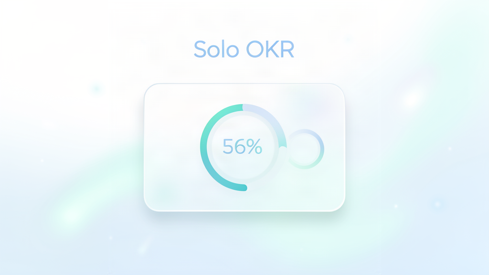

# 独行OKR · Solo OKR

> 一个人也能跑 OKR。个人目标管理系统，让成长不再等公司。

公司级 OKR 是自上而下层层拆解的一套机制，但个人成长不该等公司来推。**独行OKR** 让每个人自己管自己的目标：每月定 2 个 O（1 个成长型 + 1 个业绩型），每个 O 配可量化的 KR，每周花 15 分钟复盘打分，月末归档、开新周期。

## ✨ 特性

- **月度 OKR 闭环**：月初定目标 → 每周复盘打分 → 月末归档结算，一条完整闭环
- **清新未来 UI**：毛玻璃卡片、漂浮光晕、进度环拖拽、数字滚动动画，安静不花哨
- **数据完全本地**：存在浏览器 localStorage，无需账号、不上传任何数据、离线可用
- **单文件零依赖**：一个 `index.html`，双击即用，没有任何安装步骤
- **JSON / Excel 双格式**：JSON 完整备份（可还原），Excel 表格报表（可打印 / 手机查看）
- **悬浮解释**：目标分 / 信心指数 / 本周分，忘了随时悬停查看

## 🚀 快速开始

1. 下载仓库里的 `index.html`
2. 双击用浏览器打开（推荐 Chrome / Safari / Edge）
3. 填上你这个月的两个 O，开始

就这么简单。数据自动存本地，建议每周导出一次 JSON 备份。

## 📖 核心概念（三分钟上手）

| 概念 | 是什么 | 怎么打 |
|---|---|---|
| **O（目标）** | 你这个月想达成的方向，固定 2 个：1 成长型 + 1 业绩型 | 月初定一次 |
| **KR（关键结果）** | 可量化的结果，有「当前值 → 目标值」 | 月初定，平时更新当前值 |
| **信心指数**（0~10） | 你有几成把握完成这个 KR | 定目标时打一次：6 健康 / 9 定低了 / 2 定高了 |
| **本周分**（0~1.0） | 这周这个 KR 实际推进了多少 | 每周日复盘时打 |

## 🔧 使用建议（三条铁律）

- **2 个 O 雷打不动**：1 成长型 + 1 业绩型，30 天绝不加第三个
- **KR 只写可量化的结果**：不写「打电话」这种动作
- **连续两周 0 分的 KR 当场砍掉**：别让它背到月底拖垮整个月

## 🛠 技术栈

- 原生 HTML / CSS / JavaScript，零依赖
- 内联 [SheetJS](https://sheetjs.com/)（`xlsx.js`）实现 Excel 导入导出，版权归 SheetJS

## 📄 开源协议

[Apache License 2.0](LICENSE)

## 🤝 参与贡献

见 [CONTRIBUTING.md](CONTRIBUTING.md)

## 作者

Solo OKR · 让每个人都能管好自己
